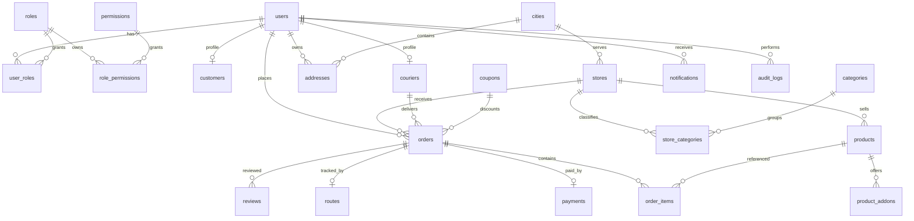

# Database ERD

```mermaid
erDiagram
  users ||--o{ user_roles : has
  roles ||--o{ user_roles : grants
  roles ||--o{ role_permissions : owns
  permissions ||--o{ role_permissions : grants
  users ||--o| customers : profile
  users ||--o| couriers : profile
  users ||--o{ addresses : owns
  cities ||--o{ addresses : contains
  cities ||--o{ stores : serves
  stores ||--o{ products : sells
  stores ||--o{ store_categories : classifies
  categories ||--o{ store_categories : groups
  products ||--o{ product_addons : offers
  users ||--o{ orders : places
  stores ||--o{ orders : receives
  couriers ||--o{ orders : delivers
  orders ||--o{ order_items : contains
  products ||--o{ order_items : referenced
  orders ||--o| payments : paid_by
  orders ||--o| routes : tracked_by
  coupons ||--o{ orders : discounts
  orders ||--o{ reviews : reviewed
  users ||--o{ notifications : receives
  users ||--o{ audit_logs : performs
```

Migrations live in `backend/src/main/resources/db/migration` and define constraints, indexes, audit timestamps, and soft-delete columns.

